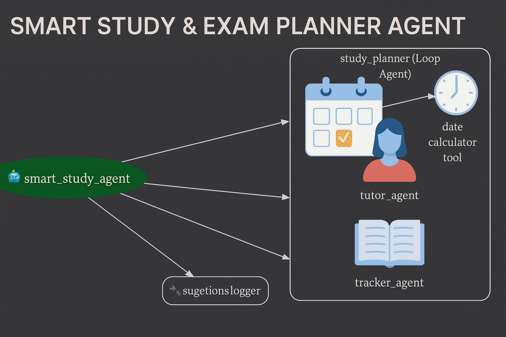

# Smart Study & Exam Planner Agent

This is the ADK-based implementation of my capstone project for the Google x Kaggle Agents Intensive Program.

## Features
- Generates daily/weekly study plans
- Tracks progress
- Stores memory across sessions
- Creates revision quiz prompts
- Multi-agent design (planner, tracker, tutor)
- Uses Google ADK and Gemini

## Files
- `agent.py` – contains the ADK agent and tools
- `data/progress.json` – automatically saved memory file

## How to run (local)
1. Install ADK:
   ```bash
   pip install google-adk
## Architecture Diagram


## Example Usage

### Generate a study plan
```python
plan = generate_study_plan(
    ["Maths", "DBMS", "OS", "Java"],
    hours_per_day=4,
    exam_date="2025-12-20",
    difficulty={"Maths": "hard", "DBMS": "medium", "OS": "medium", "Java": "easy"},
)
print(plan)

progress = log_daily_progress(
    "2025-11-30",
    completed_subjects=["Maths", "DBMS"],
    notes="Completed unit 1 revision"
)
print(progress)

